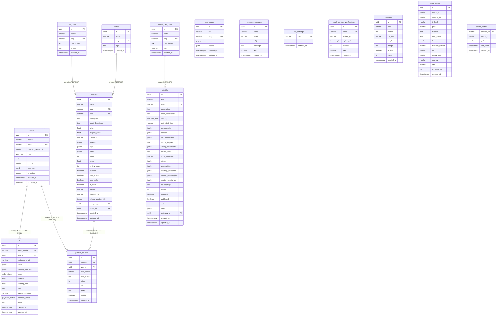

# IoTMart Database Architecture Audit

> **Scope:** Full analysis of the IoTMart e-commerce platform's database architecture.
> **Method:** Static analysis of SQLAlchemy ORM models, Pydantic schemas, API routers, Alembic migrations, Next.js frontend API client, plus live inspection of the running PostgreSQL 16 database (`iotmart`).
> **Status:** Analysis only — no code, schema, or data was modified.
> **Audited on:** 2026-08-04

---

## 1. High-Level Database Overview

### 1.1 Stack

| Layer | Technology |
|---|---|
| Database | PostgreSQL 16 (Docker, `postgres:16-alpine`) |
| Connection | `asyncpg` via SQLAlchemy 2.0 async engine |
| ORM | SQLAlchemy 2.0 (`DeclarativeBase`, `Mapped`/`mapped_column`) |
| Migrations | Alembic (async `env.py`), but **mostly non-functional** (see §6.8) |
| API | FastAPI 0.115, routers in `app/routers/*` |
| Validation | Pydantic 2.x schemas in `app/schemas/*` |
| Frontend | Next.js 16 (App Router), proxies `/api/*` → FastAPI :8000 |

### 1.2 Database

- Host: `localhost:5432`, DB `iotmart`, user `iotmart`
- 16 tables, 5 Postgres enum types, 17 enum labels
- Current `alembic_version` = `740f602fcdfd` (head)

### 1.3 Tables

| # | Table | Purpose | Est. Size |
|---|---|---|---|
| 1 | `users` | Customer & admin accounts, credentials | 2 rows |
| 2 | `categories` | Product categories | 9 |
| 3 | `brands` | Product brands | 1 |
| 4 | `products` | Catalog items | 12 |
| 5 | `product_reviews` | Customer reviews of products | 0 |
| 6 | `tutorial_categories` | Tutorial categories | 1 |
| 7 | `tutorials` | IoT project tutorials | 4 |
| 8 | `orders` | Customer orders (items + shipping embedded as JSONB) | 4 |
| 9 | `cms_pages` | CMS pages (block-based) | 0 |
| 10 | `contact_messages` | Contact form submissions | 2 |
| 11 | `site_settings` | Key/value store settings | 17 |
| 12 | `email_pending_verifications` | Pending email-OTP verifications | 2 |
| 13 | `banners` | Homepage banners | 0 (**no API — dead table**) |
| 14 | `page_views` | Analytics page-view events | 139 |
| 15 | `online_visitors` | TTL-based online visitor tracking | 1 |
| 16 | `alembic_version` | Migration version bookkeeping | 1 |

### 1.4 Overall Design Philosophy

The schema uses **UUID (v4) primary keys** everywhere, **JSONB for flexible/denormalized data**, and a small number of relational FKs. Most business structure (order items, shipping address, product specs/tags/images, tutorial steps) lives **inside JSONB columns** rather than normalized child tables. There are **no database triggers, stored procedures, computed columns, or check constraints**. Business rules (status transitions, totals, ratings) are implemented entirely in application code.

---

## 2. Entity Relationship Diagram (ERD)



**Many-to-many relationships:** none exist as join tables. Product↔Product (related products) and Tutorial↔Product / Tutorial↔Tutorial are represented as **JSONB arrays of IDs** (`related_product_ids`, `related_tutorial_ids`) with no referential integrity.

---

## 3. Table-by-Table Detail

### 3.1 `users`
| Column | Type | Null | Default | Notes |
|---|---|---|---|---|
| id | UUID | NO | (app: uuid4) | PK |
| name | VARCHAR(255) | NO | | |
| email | VARCHAR(255) | NO | | UNIQUE index `ix_users_email` |
| hashed_password | VARCHAR(255) | NO | | bcrypt |
| role | `user_role` enum | NO | `customer` (app) | See §5 |
| avatar | TEXT | YES | | URL/path |
| phone | VARCHAR(50) | YES | | |
| address | JSONB | YES | | free-form address object |
| is_active | BOOLEAN | NO | `true` (app) | login blocker |
| created_at | TIMESTAMPTZ | NO | (app: utcnow) | no server default |
| updated_at | TIMESTAMPTZ | NO | (app: utcnow+onupdate) | no server default |

**Relationships:** 1→N `orders` (FK `user_id`, ON DELETE SET NULL), 1→N `product_reviews` (ON DELETE CASCADE).
**Writers:** `POST /api/auth/register`, `POST /api/auth/login` (no write), `PATCH /api/auth/me`, `PATCH /api/users/{id}`, `DELETE /api/users/{id}`.

### 3.2 `categories`
| Column | Type | Null | Default | Notes |
|---|---|---|---|---|
| id | UUID | NO | (app) | PK |
| name | VARCHAR(255) | NO | | |
| slug | VARCHAR(255) | NO | | UNIQUE index `ix_categories_slug` |
| description | TEXT | NO | `""` (app) | |
| image | TEXT | NO | `""` (app) | |
| created_at | TIMESTAMPTZ | NO | (app) | |

**Relationships:** 1→N `products` (FK `category_id`, **no ON DELETE action**).
**Writers:** `POST /api/categories`, `PUT /api/categories/{id}`, `DELETE /api/categories/{id}` (all admin).

### 3.3 `brands`
| Column | Type | Null | Default | Notes |
|---|---|---|---|---|
| id | UUID | NO | (app) | PK |
| name | VARCHAR(255) | NO | | |
| slug | VARCHAR(255) | NO | | UNIQUE index `ix_brands_slug` |
| logo | TEXT | YES | | |
| created_at | TIMESTAMPTZ | NO | (app) | |

**Relationships:** 1→N `products` (FK `brand_id`, nullable, **no ON DELETE action**).
**Writers:** `POST /api/brands`, `PUT /api/brands/{id}`, `DELETE /api/brands/{id}` (all admin).

### 3.4 `products`
| Column | Type | Null | Default | Notes |
|---|---|---|---|---|
| id | UUID | NO | (app) | PK |
| name | VARCHAR(255) | NO | | |
| slug | VARCHAR(255) | NO | | UNIQUE index `ix_products_slug` |
| sku | VARCHAR(100) | NO | | UNIQUE constraint `products_sku_key` |
| description | TEXT | NO | `""` (app) | |
| short_description | TEXT | NO | `""` (app) | |
| price | FLOAT8 | NO | | **money stored as float** |
| original_price | FLOAT8 | YES | | |
| currency | VARCHAR(10) | NO | `"USD"` (app) | **values are actually NPR** — see §6 |
| images | JSONB | NO | `[]` (app) | `string[]` |
| tags | JSONB | NO | `[]` (app) | `string[]` |
| specs | JSONB | NO | `[]` (app) | `[{label, value}]` |
| stock | INTEGER | NO | `0` (app) | |
| rating | FLOAT8 | NO | `0.0` (app) | denormalized, recomputed in app |
| review_count | INTEGER | NO | `0` (app) | denormalized, recomputed in app |
| featured | BOOLEAN | NO | `false` (app) | |
| new_arrival | BOOLEAN | NO | `false` (app) | |
| best_seller | BOOLEAN | NO | `false` (app) | |
| in_stock | BOOLEAN | NO | `true` (app) | independent of `stock` |
| weight | VARCHAR(50) | YES | | |
| dimensions | VARCHAR(100) | YES | | |
| related_product_ids | JSONB | NO | `[]` (app) | array of product UUIDs, unvalidated |
| category_id | UUID | NO | | FK→categories, **no index** |
| brand_id | UUID | YES | | FK→brands, **no index** |
| created_at | TIMESTAMPTZ | NO | (app) | |
| updated_at | TIMESTAMPTZ | NO | (app) | |

**Relationships:** N→1 category, N→1 brand, 1→N reviews (ORM cascade `all, delete-orphan` + DB ON DELETE CASCADE).
**Writers:** `POST /api/products`, `PUT /api/products/{id}`, `DELETE /api/products/{id}` (admin), `POST /api/products/{id}/reviews` (customer, updates rating/review_count).
**Note:** No index on `category_id`/`brand_id` FKs; product list filtering by category/brand requires a slug→id lookup then a scan.

### 3.5 `product_reviews`
| Column | Type | Null | Default | Notes |
|---|---|---|---|---|
| id | UUID | NO | (app) | PK |
| product_id | UUID | NO | | FK→products ON DELETE CASCADE, **no index** |
| user_id | UUID | NO | | FK→users ON DELETE CASCADE, **no index** |
| user_name | VARCHAR(255) | NO | | denormalized snapshot |
| user_avatar | TEXT | YES | | denormalized snapshot |
| rating | INTEGER | NO | | **no CHECK (1–5)**; Pydantic doesn't bound it either |
| title | VARCHAR(255) | NO | | |
| body | TEXT | NO | `""` (app) | |
| verified | BOOLEAN | NO | `false` (app) | admin moderation flag |
| created_at | TIMESTAMPTZ | NO | (app) | |

**Relationships:** N→1 product, N→1 user.
**Writers:** `POST /api/products/{id}/reviews`, `PATCH /api/reviews/{id}/verify`, `DELETE /api/reviews/{id}` (admin).
**Notes:** No unique `(product_id, user_id)` constraint — a user can review the same product multiple times.

### 3.6 `tutorial_categories`
| Column | Type | Null | Default | Notes |
|---|---|---|---|---|
| id | UUID | NO | (app) | PK |
| name | VARCHAR(255) | NO | | |
| slug | VARCHAR(255) | NO | | UNIQUE index `ix_tutorial_categories_slug` |
| description | TEXT | NO | `""` (app) | |
| icon | VARCHAR(100) | NO | `""` (app) | |
| created_at | TIMESTAMPTZ | NO | (app) | |

**Relationships:** 1→N `tutorials`.
**Writers:** `POST /api/tutorials/categories`, `PUT/DELETE /api/tutorials/categories/{id}` (admin).

### 3.7 `tutorials`
| Column | Type | Null | Default | Notes |
|---|---|---|---|---|
| id | UUID | NO | (app) | PK |
| title | VARCHAR(255) | NO | | |
| slug | VARCHAR(255) | NO | | UNIQUE index `ix_tutorials_slug` |
| description | TEXT | NO | `""` (app) | |
| short_description | TEXT | NO | `""` (app) | |
| difficulty | `difficulty_level` | NO | `Beginner` (app) | |
| estimated_time | VARCHAR(100) | NO | `""` (app) | |
| components | JSONB | NO | `[]` (app) | string[] |
| sensors | JSONB | NO | `[]` (app) | string[] |
| microcontrollers | JSONB | NO | `[]` (app) | string[] |
| circuit_diagram | TEXT | YES | | |
| wiring_instructions | JSONB | NO | `[]` (app) | [{component, pin, ...}] |
| source_code | TEXT | NO | `""` (app) | |
| code_language | VARCHAR(50) | NO | `cpp` (app) | |
| steps | JSONB | NO | `[]` (app) | [{stepNumber, title, content, code?...}] |
| prerequisites | JSONB | NO | `[]` (app) | string[] |
| learning_outcomes | JSONB | NO | `[]` (app) | string[] |
| related_product_ids | JSONB | NO | `[]` (app) | unvalidated IDs |
| related_tutorial_ids | JSONB | NO | `[]` (app) | unvalidated IDs |
| cover_image | TEXT | NO | `""` (app) | |
| views | INTEGER | NO | `0` (app) | incremented app-side (race-prone) |
| featured | BOOLEAN | NO | `false` (app) | |
| published | BOOLEAN | NO | `false` (app) | |
| author | VARCHAR(255) | NO | `""` (app) | |
| tags | JSONB | NO | `[]` (app) | string[] |
| category_id | UUID | NO | | FK→tutorial_categories, **no index** |
| created_at | TIMESTAMPTZ | NO | (app) | |
| updated_at | TIMESTAMPTZ | NO | (app) | |

**Writers:** `POST /api/tutorials`, `PUT /api/tutorials/{id}`, `DELETE /api/tutorials/{id}` (admin); `GET /api/tutorials/{slug}` increments `views`.

### 3.8 `orders`
| Column | Type | Null | Default | Notes |
|---|---|---|---|---|
| id | UUID | NO | (app) | PK |
| order_number | VARCHAR(50) | NO | app-generated `ORD-XXXXXXXX` | UNIQUE index `ix_orders_order_number` |
| user_id | UUID | YES | | FK→users ON DELETE SET NULL |
| customer_email | VARCHAR(255) | YES | | index `ix_orders_customer_email` (non-unique) |
| items | JSONB | NO | | `[{product_id, product_name, product_image, price, quantity, subtotal}]` |
| shipping_address | JSONB | NO | | `{first_name, last_name, phone, address_line1, address_line2, city, state, zip_code, country}` |
| status | `order_status` | NO | `pending` (app) | see §5 |
| subtotal | FLOAT8 | NO | | |
| shipping_cost | FLOAT8 | NO | `0.0` (app) | |
| total | FLOAT8 | NO | | computed app-side |
| payment_method | VARCHAR(100) | NO | `cod` | |
| payment_status | `payment_status` | NO | `pending` (app) | |
| notes | TEXT | YES | | |
| created_at | TIMESTAMPTZ | NO | (app) | |
| updated_at | TIMESTAMPTZ | NO | (app) | |

**Relationships:** N→1 user.
**Writers:** `POST /api/orders`, `PATCH /api/orders/{id}/cancel`, `PATCH /api/orders/{id}/status` (admin).
**Notes:** `tax` column was dropped in the latest migration (`740f602fcdfd`); **legacy rows still contain totals that included tax** (verified: one order total 1566 = 1450 × 1.08 with 0 shipping), so `total ≠ subtotal + shipping_cost` for historical records.

### 3.9 `cms_pages`
| Column | Type | Null | Default | Notes |
|---|---|---|---|---|
| id | UUID | NO | (app) | PK |
| title | VARCHAR(255) | NO | | |
| slug | VARCHAR(255) | NO | | UNIQUE index `ix_cms_pages_slug` |
| status | `page_status` | NO | `draft` (app) | |
| blocks | JSONB | NO | `[]` (app) | block-editor structure |
| created_at | TIMESTAMPTZ | NO | (app) | |
| updated_at | TIMESTAMPTZ | NO | (app) | |

**Writers:** `POST /api/cms/pages`, `PUT /api/cms/pages/{id}`, `DELETE /api/cms/pages/{id}` (admin).

### 3.10 `contact_messages`
| Column | Type | Null | Default | Notes |
|---|---|---|---|---|
| id | UUID | NO | (app) | PK |
| name | VARCHAR(255) | NO | | |
| email | VARCHAR(255) | NO | | no index |
| subject | VARCHAR(100) | NO | | |
| message | TEXT | NO | | |
| read | BOOLEAN | NO | `false` (app) | |
| created_at | TIMESTAMPTZ | NO | (app) | |

**Writers:** `POST /api/contact` (public, rate-limit-free), `PATCH /api/contact/{id}/read`, `DELETE /api/contact/{id}` (admin).

### 3.11 `site_settings`
| Column | Type | Null | Default | Notes |
|---|---|---|---|---|
| key | VARCHAR(100) | NO | | PK |
| value | TEXT | NO | `""` (app) | |
| updated_at | TIMESTAMPTZ | NO | (app) | |

**Semantics:** arbitrary key/value store; app merges `DEFAULTS` dict with saved rows. Keys observed live: `store_*`, `shipping_free_threshold` (=`5000`), `shipping_default_cost` (=`100`), `shipping_processing_days`, `tax_rate` (=`8`), `tax_id`, `notify_*`.
**Writers:** `GET/PUT /api/settings`. Shipping rules read from here by `POST /api/orders`.

### 3.12 `email_pending_verifications`
| Column | Type | Null | Default | Notes |
|---|---|---|---|---|
| id | UUID | NO | (app) | PK |
| email | VARCHAR(255) | NO | | UNIQUE `ix_email_pending_verifications_email` |
| hashed_otp | VARCHAR(255) | NO | | bcrypt |
| expires_at | TIMESTAMPTZ | NO | | |
| attempts | INTEGER | NO | `0` | max 5 enforced app-side |
| used | BOOLEAN | NO | `false` | |
| created_at | TIMESTAMPTZ | NO | (app) | |

**Writers:** `POST /api/auth/request-otp` (upsert), `POST /api/auth/verify-otp`, `POST /api/auth/register` (deletes row).
**Notes:** Expired rows are never purged (2 stale rows found live).

### 3.13 `banners` ⚠️ **DEAD TABLE**
| Column | Type | Null | Default |
|---|---|---|---|
| id | UUID | NO | (app) |
| title | VARCHAR(255) | NO | |
| subtitle | TEXT | NO | `""` |
| cta_text | VARCHAR(100) | NO | `""` |
| cta_link | VARCHAR(500) | NO | `""` |
| image | TEXT | NO | `""` |
| active | BOOLEAN | NO | `true` |
| order | INTEGER | NO | `0` |
| created_at | TIMESTAMPTZ | NO | (app) |

**No router/API endpoint reads or writes this table.** The frontend "Banners" admin page operates on **static mock data** (`src/data/orders.ts`). Zero rows live.

### 3.14 `page_views`
| Column | Type | Null | Default | Notes |
|---|---|---|---|---|
| id | UUID | NO | (app) | PK |
| visitor_id | VARCHAR(64) | NO | | hashed pseudo-anon ID, indexed |
| session_id | VARCHAR(64) | NO | | client-supplied UUID, indexed |
| ip_hash | VARCHAR(64) | NO | | SHA-256(SALT+IP); never raw |
| path | VARCHAR(2048) | NO | | indexed |
| referrer | TEXT | YES | | |
| user_agent | TEXT | YES | | |
| browser | VARCHAR(100) | YES | | parsed |
| browser_version | VARCHAR(50) | YES | | |
| os | VARCHAR(100) | YES | | |
| device_type | VARCHAR(50) | YES | | desktop/mobile/tablet/bot/unknown |
| country | VARCHAR(100) | YES | | **never populated** (no geo service) |
| city | VARCHAR(100) | YES | | **never populated** |
| duration_ms | INTEGER | YES | | set on heartbeat/unload |
| created_at | TIMESTAMPTZ | NO | (app) | indexed |

**Indexes (live):** `page_views_pkey`, `ix_page_views_created_at`, `ix_page_views_path`, `ix_page_views_session_id`, `ix_page_views_visitor_id`.
**Writers:** `POST /api/analytics/track`, `POST /api/analytics/heartbeat`.
**Notes:** Unbounded event log; no retention policy. The composite `(created_at, visitor_id)` index exists **only in the migration**, not in the live DB (drift, §6.8).

### 3.15 `online_visitors`
| Column | Type | Null | Default | Notes |
|---|---|---|---|---|
| session_id | VARCHAR(64) | NO | | PK |
| visitor_id | VARCHAR(64) | NO | | indexed |
| path | VARCHAR(2048) | NO | | |
| last_seen | TIMESTAMPTZ | NO | (app+onupdate) | indexed |
| created_at | TIMESTAMPTZ | NO | (app) | |

**Writers:** background task on `/api/analytics/track` & `/heartbeat` (upsert), pruned by `prune_online_visitors` (TTL 300s).

### 3.16 `alembic_version`
Single-column `version_num` (VARCHAR). Currently `740f602fcdfd`.

---

## 4. Relationship Map & Data Flow

### 4.1 Relational (FK) relationships
| From | To | Type | On delete | Purpose |
|---|---|---|---|---|
| `orders.user_id` → `users.id` | users | M:1 | **SET NULL** | order ownership; keeps order when user deleted |
| `product_reviews.user_id` → `users.id` | users | M:1 | **CASCADE** | reviews vanish with user |
| `product_reviews.product_id` → `products.id` | products | M:1 | **CASCADE** | reviews vanish with product |
| `products.category_id` → `categories.id` | categories | M:1 | **RESTRICT** (default) | delete blocked if products exist |
| `products.brand_id` → `brands.id` | brands | M:1 | **RESTRICT** (default) | delete blocked if products exist |
| `tutorials.category_id` → `tutorial_categories.id` | tutorial_categories | M:1 | **RESTRICT** (default) | delete blocked if tutorials exist |

### 4.2 Logical (JSONB-encoded) relationships
| Relationship | Representation | Integrity |
|---|---|---|
| Product ↔ Product (related) | `products.related_product_ids` (JSONB array of UUIDs) | **None** |
| Tutorial ↔ Product | `tutorials.related_product_ids` | **None** |
| Tutorial ↔ Tutorial | `tutorials.related_tutorial_ids` | **None** |
| Order → items | `orders.items` (JSONB array of snapshots) | **None** (snapshot intentional) |
| Order → shipping address | `orders.shipping_address` (JSONB object) | **None** (snapshot intentional) |
| Review → author identity | `product_reviews.user_name`/`user_avatar` denormalized | Drift risk |

### 4.3 End-to-end data flow (frontend → backend → DB)
```
Browser / Next.js UI
   │  src/lib/api.ts (typed client)
   ▼
Next.js API proxy  src/app/api/[...path]/route.ts
   │  forwards headers incl. Authorization + cookies, keeps streaming
   ▼
FastAPI routers (app/routers/*) → Pydantic schemas (app/schemas/*)
   │  get_db() dependency (async session, auto-commit)
   ▼
SQLAlchemy models (app/models/models.py)
   ▼
PostgreSQL 16 (asyncpg, pool_pre_ping)
```

- **Server components** (e.g. home page) call the FastAPI internal URL directly with ISR caching (`revalidate: 60`).
- **Client components** call relative `/api/...` which the proxy forwards.
- Auth token is sent as `Authorization: Bearer <token>`; refresh token travels as an httpOnly cookie relayed by the proxy.

---

## 5. Enums

Defined as Postgres native enum types (no `varchar` fallbacks). **There are no application-level enum classes** — routers use string literals.

| Enum type | Values | Used by | Notes |
|---|---|---|---|
| `user_role` | `customer`, `admin` | `users.role` | Admin checks are string comparisons (`role != "admin"`) |
| `order_status` | `pending`, `processing`, `shipped`, `delivered`, `cancelled`, `refunded` | `orders.status` | **`shipped` and `refunded` unreachable via API** (`VALID_STATUSES` in `orders.py` = `{pending, processing, delivered, cancelled}`); frontend colors only cover 4 states |
| `payment_status` | `pending`, `paid`, `failed`, `refunded` | `orders.payment_status` | Only `pending`/`paid` ever set; `paid` auto-set on `delivered` |
| `page_status` | `draft`, `published` | `cms_pages.status` | |
| `difficulty_level` | `Beginner`, `Intermediate`, `Advanced` | `tutorials.difficulty` | |

---

## 6. Redundancy, Dead Schema, Duplicate Data & Normalization Issues

### 6.1 Dead/unused tables
- **`banners`** — no API endpoint, no frontend consumption, 0 rows. The admin "Banners" page edits **static mock data**. Either wire it up or remove it.
- **`page_views.country` / `city`** — columns exist but nothing populates them (no geo-IP service wired). Effectively dead columns.
- **`site_settings.tax_rate` / `tax_id`** — tax is no longer computed (column dropped), yet settings still expose `tax_rate: 8` and `tax_id`. Dead configuration.

### 6.2 Unused/duplicated frontend data
- `src/data/products.ts`, `src/data/categories.ts`, `src/data/tutorials.ts`, `src/data/orders.ts` — large static catalogs used as **fallbacks or hardcoded UI data** (e.g. admin dashboard uses `salesStats`, `revenueChartData`, `topProductsData` — all mock). The admin dashboard does **not** use the analytics API for revenue, so dashboard KPIs are fake until wired.

### 6.3 Denormalization (deliberate but risky)
| Denormalized field | Risk |
|---|---|
| `product_reviews.user_name` / `user_avatar` | Stale identity if a user renames/changes avatar |
| `products.rating` / `review_count` | Recomputed in app code on add/delete review; a missed path desyncs them (e.g., direct DB writes, review edit flows). Two code paths do this (products.py add, reviews.py delete) with divergent logic |
| `orders.items` / `shipping_address` | Intentionally frozen snapshots (correct for e-commerce) |
| `products.in_stock` vs `products.stock` | Two independent signals that can drift (`in_stock=true` while `stock=0`); `stock` is **never decremented** by any flow |

### 6.4 Normalization opportunities (currently JSONB)
- `order_items` table (currently array inside `orders.items`) — makes order-level reporting, stock/inventory joins, and product sales analytics require JSONB queries.
- `tutorial_steps` / `wiring_pins` child tables.
- `product_specs` table.
- Proper M:N join tables for `related_product_ids` and `related_tutorial_ids` (currently unvalidated ID arrays).

### 6.5 Currency / pricing inconsistency (data quality)
- Live `products.currency` = `"USD"` for **all** rows, but prices are mixed: Arduino Uno R3 = 1200, Raspberry Pi 4 = 17500 (clearly NPR) while NodeMCU = 5.99, HC-SR04 = 3.99 (genuine USD). Meanwhile `site_settings.store_currency` = `NPR`, frontend renders `Rs.`, and shipping thresholds live in NPR (5000). The `currency` column cannot be trusted.

### 6.6 Order total inconsistency (legacy)
- Verified live: `ORD-Y13GT9UL` total=1566 with subtotal=1450, shipping=0 (tax was folded in before the `tax` column drop). `ORD-IYY6M3W0` total=270 vs subtotal=250+0 shipping. **`total ≠ subtotal + shipping_cost`** on 2 of 4 orders. Any reconciliation/reporting must not assume consistency.

### 6.7 Duplicate / stale verification rows
- `email_pending_verifications` rows are deleted only on successful registration. Expired/unused OTPs accumulate (2 stale rows live, both already expired).

### 6.8 Migration drift — critical
- The **initial Alembic migration `a65fa1e49e33` is a no-op**. All core tables are created at app startup by `Base.metadata.create_all` (`main.py` lifespan), not by migrations.
- Live indexes on `page_views` include `ix_page_views_created_at`, `path`, `session_id`, `visitor_id` — matching the model. But the migration `add_analytics_tables.py` also created **`ix_page_views_created_at_visitor`** (composite), which is **absent** in the live DB (create_all path doesn't create it — the model only has a comment in `__table_args__`).
- Result: schema is effectively **unversioned**; `alembic_version` claims `740f602fcdfd` but most DDL is not represented. Fresh deployments are non-deterministic (migrations ≠ create_all output).

---

## 7. Performance Analysis

### 7.1 Indexes present
- Unique: users.email, categories.slug, brands.slug, products.slug, products.sku, tutorials.slug, tutorial_categories.slug, cms_pages.slug, orders.order_number, email_pending_verifications.email.
- Plain: orders.customer_email, page_views(created_at, path, session_id, visitor_id), online_visitors(visitor_id, last_seen).

### 7.2 Missing indexes (verified live)
| Table | Missing FK/query column index | Impact |
|---|---|---|
| `products` | `category_id`, `brand_id` | Category/brand filter + delete-restrict checks do sequential scans |
| `product_reviews` | `product_id`, `user_id` | Product detail review load + user cascade deletes scan |
| `tutorials` | `category_id` | Category filter scans |
| `contact_messages` | `email` | Minor |
| `orders` | `status`, `user_id` | Admin status filters and per-user history scans |

### 7.3 N+1 / query-pattern risks
- **Product list** (`GET /api/products`) uses `selectinload` for category, brand, **and full reviews** → every product card carries every review. Avoids N+1 but transfers heavy payloads for paginated lists.
- **Category list** (`GET /api/categories`) does a correct single grouped aggregate for `product_count` (good).
- **Admin reviews list** eager-loads product (fine).
- **Analytics `get_summary`** issues ~9 sequential COUNT/DISTINCT queries.
- **`POST /api/orders`** issues a settings read per key (2 sequential queries) plus a lookups; order listing has **no pagination** — grows linearly.

### 7.4 Serialization / concurrency hazards
- **`asyncio.gather` on a single `AsyncSession`** (`GET /api/analytics/dashboard`): all six analytics functions share one async session/connection. SQLAlchemy's async session cannot run concurrent `execute` calls safely (connection is busy → "another operation is in progress"). Likely to error or serialize unpredictably under load; should use separate sessions or run sequentially.
- **Tutorial `views` increment** is read-modify-write in the app (`tutorial.views = views + 1`) — lost updates under concurrency; should be `UPDATE ... SET views = views + 1`.
- **Product rating recompute** does a full `SELECT rating` over all reviews of the product on every review add/delete — O(reviews) per write.

### 7.5 Scalability concerns
- `page_views` is an **unbounded append-only log** with no partitioning or retention; every dashboard aggregate scans the whole table (`top-pages`, `trend`, `summary`).
- Search uses `ILIKE '%...%'` (no trigram/GIN index) — full scans on products and tutorials.
- Order listing returns all rows, no limit/offset/cursor.
- `online_visitors` prunes only opportunistically inside background tasks — if the API is idle, stale rows persist (minor).

### 7.6 Optimization opportunities (non-invasive, DB-level)
- Add indexes on `products(category_id)`, `products(brand_id)`, `product_reviews(product_id)`, `product_reviews(user_id)`, `tutorials(category_id)`, `orders(status)`, `orders(user_id)`.
- Create the missing composite `page_views(created_at, visitor_id)`.
- Add a `pg_trgm` GIN index on `products(name, description)` and `tutorials(title, description)` for ILIKE.
- Add daily-partitioned `page_views` or a retention job.
- Store money as `NUMERIC(12,2)`.

---

## 8. Data Integrity Analysis

### 8.1 Foreign key consistency
- All FK columns validated → **zero orphan rows currently** (checked live: products→categories, products→brands, orders→users, reviews→both, tutorials→categories).
- `orders.user_id` correctly nullable with `ON DELETE SET NULL` (good — preserves orders).
- Deleting a category/brand with existing products raises an unhandled DB `IntegrityError` → HTTP 500 (the DELETE endpoints don't catch/translate it).

### 8.2 Missing constraints / validation gaps
| Gap | Detail |
|---|---|
| No CHECK on `product_reviews.rating` | App schema `ReviewCreate.rating: int` has no bounds → ratings outside 1–5 possible |
| No CHECK on `products.price >= 0` | Negative prices possible |
| No UNIQUE `(product_id, user_id)` on reviews | Duplicate reviews by the same user |
| No UNIQUE on `tutorials` related IDs / no FK on JSONB arrays | `related_product_ids` can point to deleted products |
| `orders.order_number` | Random 8-char (`ORD-XXXXXXX`); collisions raise unhandled IntegrityError (no retry) |
| No CHECK on `orders` amounts / status transitions | `total` can be inconsistent with fields (verified live) |
| `status`/`payment_status` transition rules | Enforced only in code; no DB-level or state-machine guarantee; a cancelled order can later be marked delivered; `shipped`/`refunded` unreachable |
| `stock` never validated vs `in_stock` | Oversell possible |
| `site_settings` | Free-form keys/values, no schema/validation |
| No server-side defaults | All `created_at`/`updated_at`/JSONB arrays rely on Python defaults; raw SQL inserts fail NOT NULL |
| Tutorial category delete | RESTRICT → 500 if tutorials exist; no pre-check |

### 8.3 Application-level (not DB) rules
- Order totals & shipping computed in `POST /api/orders` from **client-supplied item prices**.
- Product rating/review_count recomputed in `products.py` and `reviews.py`.
- Status → payment transitions in `orders.py` (delivered → paid).
- OTP expiry/attempts in `auth.py`.
- No triggers, no computed/generated columns, no DB-level validation anywhere.

---

## 9. Security Analysis

### 9.1 Sensitive data stored
| Data | Where | Protection |
|---|---|---|
| Password hashes (bcrypt) | `users.hashed_password` | ✔ bcrypt via passlib |
| OTP hashes (bcrypt) | `email_pending_verifications.hashed_otp` | ✔ |
| Full names, emails, phones, addresses | `users`, `orders`, `contact_messages` | Plaintext (expected PII) |
| PII in JSONB | `users.address`, `orders.shipping_address` | Plaintext |
| IP addresses | `page_views.ip_hash` (SHA-256 + static salt), **never raw** | ✔ hashed, but static salt is reversible by brute-force for common ranges |
| User-agent, referrer, path | `page_views` | Plaintext |

### 9.2 Authentication & session model
- **JWT (HS256)**, 24h access token + 7d refresh token stored in an **httpOnly, SameSite=Lax cookie** (Secure only in production env). No server-side session store.
- **No refresh-token rotation or revocation** — a stolen cookie is valid until expiry; `POST /auth/logout` merely deletes the cookie (token stays valid).
- Frontend keeps the **access token in `localStorage`** (`customer_token`/`admin_token`) → XSS-stealable.
- OTP flow is well-designed: bcrypt-hashed, max 5 attempts, 5-min expiry, upsert per email, generic error messages, verification token scoped to email. ✔ (but see §9.4).

### 9.3 Authorization
- Role checks are string comparisons `current.role == "admin"` in each endpoint. No middleware, no role enum helper.
- `PATCH /api/users/{id}` allows a user to edit themselves or admin edits anyone — but **any authenticated user can also submit `role` via `UserUpdate`?** → No: `UserUpdate` schema exposes only `name, phone, avatar, address, password`, so role is not client-modifiable via that path. Good.
- Admin data (customers, orders, reviews, analytics, settings, uploads) is correctly guarded by `get_current_admin`.
- **Order tampering vector:** `POST /api/orders` trusts client-supplied `items[].price`/`subtotal`; the server sums them with no cross-check against `products.price`. A malicious client can order for free. Critical.
- **`GET /api/orders` (customer)** filters by `user_id` — correct. `GET /api/orders/{id}` enforces ownership. ✔

### 9.4 Remaining security recommendations
1. **Verify order prices server-side** against `products` before computing totals (critical).
2. Move access token to httpOnly cookie or rotate; add refresh-token rotation + revocation list.
3. Remove the `dev_otp` exposure path (only when `smtp_host` empty — acceptable in dev, must be a hard error in prod).
4. Rate-limit the public `POST /api/contact` (currently unthrottled spam vector).
5. Upload: validate file **content** (magic bytes), not just declared content-type; consider storing uploads outside the webroot and serving via authenticated route; filename handling is safe (server-generated) but extension is taken from client (`file.filename`) — whitelist it.
6. CORS only allows `http://localhost:3000` — fine for dev; must be explicit origins in prod.
7. Rate limiter (`slowapi`) is **in-memory** → per-process; not effective across multiple workers; consider Redis-backed.
8. `user_agent`/`referrer` stored up to 1000/2048 chars — fine; consider truncation already handled.
9. Static analytics salt means hashed IPs can be brute-forced for private ranges — document/rotate salt, or use HMAC with a server secret.
10. Sensitive PII (address/phone) is exposed in admin lists without access logging — consider audit logging.

---

## 10. Lifecycle Summaries (Database Perspective)

### 10.1 Authentication flow
```
1. POST /auth/request-otp {email}
     → checks users.email not taken
     → upsert email_pending_verifications (hashed_otp, expires_at=+5m, attempts=0, used=false)
     → sends email (dev: prints OTP)
2. POST /auth/verify-otp {email, otp}
     → SELECT pending → checks used/expired/attempts<5 → increment attempts → verify hash
     → sets used=true → returns JWT (type=email_verified, ~7min)
3. POST /auth/register {name,email,password,verification_token}
     → decode token, check type + email match → INSERT users (bcrypt pw, role=customer, is_active=true)
     → DELETE pending verification row → sets refresh cookie → returns access token
4. POST /auth/login        → SELECT user, verify pw, check is_active → cookies+tokens
5. POST /auth/refresh      → decode refresh cookie → new access + rotated refresh (no revocation of old)
6. POST /auth/logout       → deletes cookie only
7. GET/PATCH /auth/me      → reads/updates users (password hash re-hashed if present)
```
**DB writes:** `email_pending_verifications` (insert/update/delete), `users` (insert/update).

### 10.2 User lifecycle
```
request-otp → verify-otp → register (INSERT users, role=customer)
   → PATCH /auth/me or /users/{id} updates profile (name/phone/avatar/address/password)
   → places orders (orders.user_id, ON DELETE SET NULL)
   → writes reviews (product_reviews.user_id, ON DELETE CASCADE)
   → admin can DELETE /users/{id}
        → product_reviews removed (CASCADE)
        → orders preserved but user_id set NULL
   → is_active=false deactivates (blocks login + token refresh)
```
**Notes:** There is **no password-reset flow** (only OTP registration). No email re-verification on profile email change (`PATCH /me` can change email without verification).

### 10.3 Order lifecycle
```
1. Cart (localStorage only — no DB table)
2. POST /orders (auth required)
     → reads site_settings (shipping_free_threshold=5000, shipping_default_cost=100)
     → INSERT orders: items (JSONB snapshot), shipping_address (JSONB), subtotal=Σ client subtotals,
       shipping_cost (0 if ≥ threshold else default), total=subtotal+shipping, status=pending,
       payment_status=pending, payment_method=cod, customer_email=current.email
     → stock is NOT decremented; product prices NOT verified
3. PATCH /orders/{id}/cancel (owner, only if status=pending) → status=cancelled
4. PATCH /orders/{id}/status (admin) → one of {pending,processing,delivered,cancelled}
     → if delivered → payment_status=paid
     → shipped/refunded NOT settable
```
**DB writes:** `orders` (insert, update status), `site_settings` (read).

### 10.4 Inventory flow
- **There is effectively no inventory flow.** `products.stock` and `products.in_stock` are static values set via admin `POST/PUT /api/products`.
- Nothing decrements stock on order, nothing re-validates availability at checkout, `in_stock` never auto-flips, no low-stock alerts despite `site_settings.notify_low_stock`.
- **Recommendation:** decrement stock transactionally at order creation; flip `in_stock` from `stock`; enforce server-side stock check before accepting an order.

### 10.5 Payment flow
- **No real payment integration.** All orders default to `payment_method = "cod"`.
- `payment_status` starts `pending`; set to `paid` only when admin marks the order `delivered`.
- `failed` and `refunded` values exist in the enum but are never set by any code path; `refunded` order status also unreachable.
- `payment_method` is stored as free `VARCHAR(100)` from the client (no enum/whitelist).

### 10.6 Review lifecycle
```
POST /products/{id}/reviews (customer, auth)
   → INSERT product_reviews (snapshot user_name/avatar, verified=false)
   → UPDATE products.review_count += 1, recompute products.rating = AVG(rating)
Admin: PATCH /reviews/{id}/verify  (toggle verified)
Admin: DELETE /reviews/{id} → recompute products.review_count/rating
Product delete → reviews cascade-deleted (DB CASCADE + ORM delete-orphan)
```

### 10.7 Analytics lifecycle
```
Frontend AnalyticsBeacon (per route change)
   → POST /analytics/track {path, referrer, session_id}
        if admin/bot path → skip
        if duration_ms provided → UPDATE most recent page_views.duration_ms for session+path
        else → INSERT page_views (visitor_id from sha256(ip_hash+ua), ip_hash, parsed UA fields,
                 country/city left NULL)
        background task → UPSERT online_visitors(session_id, last_seen=now) + DELETE stale (TTL 300s)
   → POST /analytics/heartbeat (every 30s) → update last_seen + optional duration
Admin GET /analytics/* → aggregate counts over page_views / online_visitors
```

---

## 11. Consolidated Findings & Recommended Priorities

### Critical
1. **Client-controlled order pricing** — verify prices server-side (security + revenue).
2. **Migrations are a no-op / drift** — baseline a real migration so schema is versioned (`create_all` is not deterministic).
3. **No inventory decrement / no stock validation** — oversell and zero inventory accounting.

### High
4. Unhandled `IntegrityError` → 500s on delete of categories/brands/tutorial-categories with children.
5. Currency inconsistency (`USD` label, NPR values) — pick one, migrate data.
6. `orders.total` inconsistency with line items for legacy rows.
7. Missing FK indexes on `products.category_id`, `products.brand_id`, `product_reviews.product_id/user_id`, `tutorials.category_id`.
8. `asyncio.gather` on shared `AsyncSession` in analytics dashboard.
9. JWT in `localStorage` + no refresh-token revocation.

### Medium
10. Dead `banners` table + fake admin-dashboard sales data.
11. `shipped`/`refunded` statuses unreachable; `failed`/`refunded` payment states unused.
12. No `(product_id, user_id)` unique constraint on reviews; unbound `rating`.
13. Unbounded `page_views` growth, no retention/partitioning.
14. Unthrottled public contact endpoint.
15. Stale `email_pending_verifications` rows (no expiry purge).
16. Tutorial `views` lost-update race; money as `FLOAT`.
17. `page_views.country/city` dead columns; `site_settings.tax_*` dead config.

### Low / Cleanup
18. Duplicate `user_name/avatar` snapshots (acceptable, but document); unused frontend static catalogs.
19. `gen_order_number` collision handling; `payment_method` whitelist.
20. Add missing composite analytics index from migration to live schema.

---

*End of audit. No files, migrations, models, or schema were modified.*
